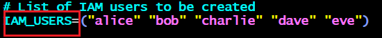
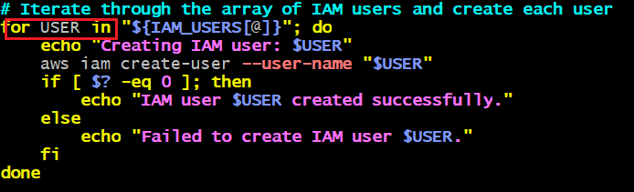
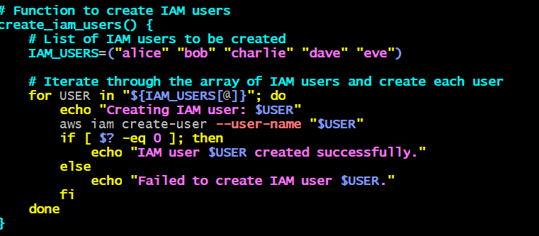
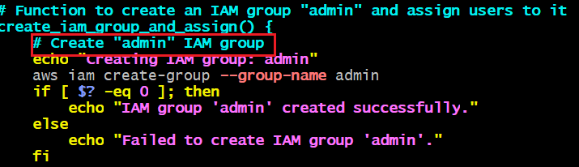
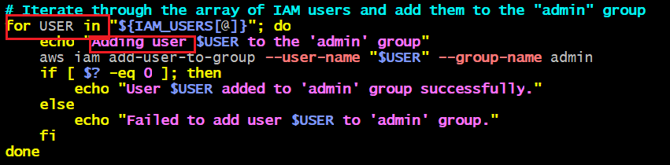

# Linux-administration-shell-scripting
capstone-project
This project is about automating the process of managing AWS Identity and Access Management (IAM) resources.
## Define IAM User Names Array
- A list of IAM user names ("alice", "bob", "charlie", "dave", "eve") is stored in the array IAM_USERS.

## Creating IAM Users
- Function to iterate through the IAM user names array.

- IAM users was created for each emolyee using AWS CLI command

## Function to create an IAM group
- Function to create an IAM group named admin was define using AWS CLI
- Administrator Access was attached to the group as a privilege to perform administrative policy.

## Assigning users to the group.
- The array of IAM user names was iterated through and easch user was assigned to admin group.

## The function used in the project are:
### Function to create an IAM group "admin" and assign users to it
create_iam_group_and_assign() {
    # Create "admin" IAM group
    echo "Creating IAM group: admin"
    aws iam create-group --group-name admin
    if [ $? -eq 0 ]; then
        echo "IAM group 'admin' created successfully."
    else
        echo "Failed to create IAM group 'admin'."
    fi

    # Iterate through the array of IAM users and add them to the "admin" group
    for USER in "${IAM_USERS[@]}"; do
        echo "Adding user $USER to the 'admin' group"
        aws iam add-user-to-group --user-name "$USER" --group-name admin
        if [ $? -eq 0 ]; then
            echo "User $USER added to 'admin' group successfully."
        else
            echo "Failed to add user $USER to 'admin' group."
        fi
    done
}

### Function to create IAM users
create_iam_users() {
    # List of IAM users to be created
    IAM_USERS=("alice" "bob" "charlie" "dave" "eve")

    # Iterate through the array of IAM users and create each user
    for USER in "${IAM_USERS[@]}"; do
        echo "Creating IAM user: $USER"
        aws iam create-user --user-name "$USER"
        if [ $? -eq 0 ]; then
            echo "IAM user $USER created successfully."
        else
            echo "Failed to create IAM user $USER."
        fi
    done
}

## Testing 
- Test check_aws_cli to ensure it correctly identifies if AWS CLI is installed or not.
- Test check_aws_profile to verify that it detects when the AWS profile is unset.
- Test create_iam_users to ensure users are created successfully.
- Test create_iam_group_and_assign to validate that the group is created and users are assigned to it.
- Running the script with valid arguments (e.g., local, testing, production) and check if the correct environment messages are displayed.
- Testing if the IAM users are created and listed in the AWS Management Console or using AWS CLI (aws iam list-users).
- Verifying that the "admin" group is created and users are added to it.
- Checking that the private key or sensitive data is not hardcoded in the script.
- Ensuring IAM permissions for the script's role or user are restricted to the minimum required for operations.
- Verifying that the "admin" group assignment does not grant unintended permissions.
